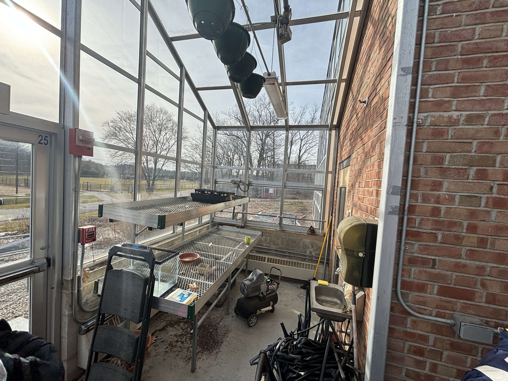
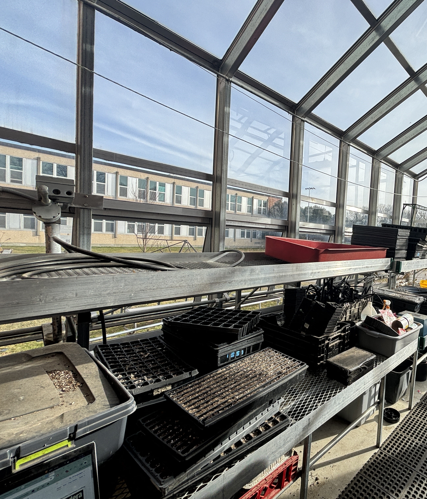
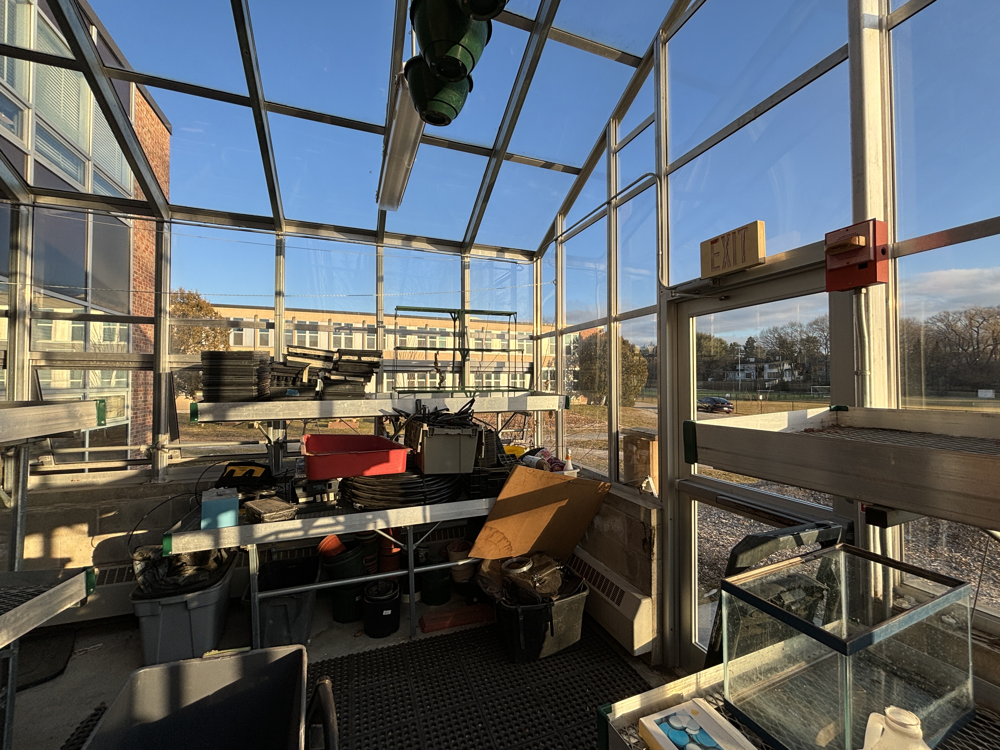
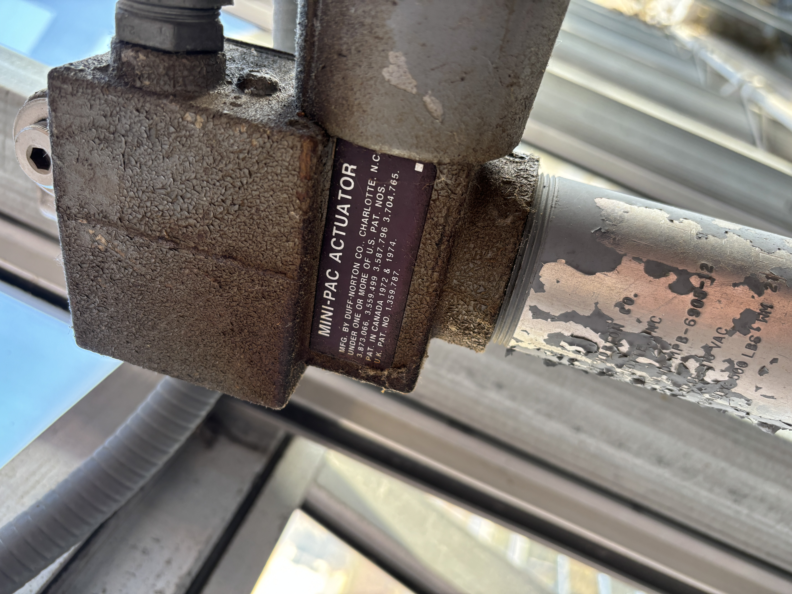

# Hydro Dydro

> For my senior year sustainability project, I built multiple hydroponic systems to explore new ways of food growth.

# Intro
During the Food and Agriculture unit of my sustainability class, I learned about the intensive nature of our modern agricultural industry. Big farm(a) inefficiently pumps as many resources as possible into their crops to maximize yield, often to the deficit of our environment. Our modern farms use large swathes of land and egregious tons of fertilizer. Is there a way to grow our food efficiently? Specifically, how do we minimize the space our crops grow in, the nutrients they require, and the energy they consume while maximizing crop yield and its health?

This led me to hydroponics.

# Overview
The Hydro Dydro project has three main parts: the Nutrient Film Technique (NFT) growing setup, the Deep Water Culture (DWC) growing setup, and renovation of my school's greenhouse.

## Greenhouse Renovation

### Cleaning
To the surprise of many of my classmates, Newton South High School has a greenhouse. However, it is tucked away in the far back of the school, right behind the science department. It was also completely out of commission. When I got to the room, the science department had made it the storage closet for all things dirt covered and semi-outdoorsy.

|  |  |  |

Regardless, I removed the garbage, moved in tables, and brought in some tools, transforming the neglected space into a gardening hub.

### Fixing Climate Control
Originally, the greenhouse could climate control its interior by opening and closing four windows. However, the actuation of these motors have gone out of repair. Some windows were permanently open, a no go for any plant who wants to grow in a New England winter. Unable to rely on the school to fix the issue (teachers before me have tried and failed), I moved towards a cheaper, jankier option: I detached the broken actuators from their windows.

|  |  |  |

Now, instead of New England's surprise winter gusts during late March, the greenhouse hits a cozy 70°.

## Nutrient Film Technique

## Budget
This project cost about $500. Fortunately, it was funded through a grant from the Newton Conservators.

